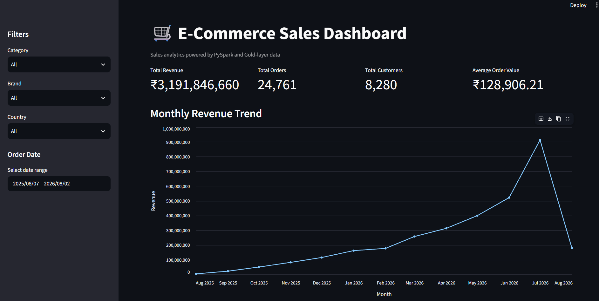

# E-Commerce Data Engineering & Analytics Pipeline

An end-to-end local data engineering project built using **Python, PySpark, Apache Spark, and Streamlit**. The project demonstrates a **Medallion Architecture (Bronze, Silver, Gold)** for processing e-commerce data and producing analytics-ready datasets and an interactive dashboard.

---

## Architecture

```text
                    ┌─────────────────────┐
                    │   Data Generator    │
                    │   Python + Faker    │
                    └──────────┬──────────┘
                               │
                               ▼
                    ┌─────────────────────┐
                    │   Bronze Layer      │
                    │      Raw Data       │
                    │  Data Validation    │
                    └──────────┬──────────┘
                               │
                               ▼
                    ┌─────────────────────┐
                    │   Silver Layer      │
                    │ PySpark Transformations │
                    │ Cleaning & Standardization │
                    └──────────┬──────────┘
                               │
                               ▼
                    ┌─────────────────────┐
                    │    Gold Layer       │
                    │     fact_sales      │
                    │ Analytics-Ready Data│
                    └──────────┬──────────┘
                               │
                               ▼
                    ┌─────────────────────┐
                    │      Analytics      │
                    │    PySpark Metrics  │
                    └──────────┬──────────┘
                               │
                               ▼
                    ┌─────────────────────┐
                    │ Streamlit Dashboard │
                    │      + Altair       │
                    └─────────────────────┘
```

---

## Project Overview

The project simulates an e-commerce data platform where customer, product, order, order-item, payment, and return data are generated and processed through multiple data layers.

The project follows the **Medallion Architecture**:

* **Bronze** – Raw generated source data
* **Silver** – Cleaned and transformed datasets
* **Gold** – Analytics-ready business dataset
* **Analytics** – Business metrics and aggregations
* **Dashboard** – Interactive visualization using Streamlit

The current implementation runs **locally using Apache Spark**.

---

## Technology Stack

| Technology   | Purpose                                                     |
| ------------ | ----------------------------------------------------------- |
| Python       | Data generation, pipeline logic and application development |
| PySpark      | Data transformation and processing                          |
| Apache Spark | Execution engine for ETL transformations                    |
| Pandas       | Converting aggregated Spark DataFrames for visualization    |
| Streamlit    | Interactive analytics dashboard                             |
| Altair       | Data visualization                                          |
| Parquet      | Storage format for processed datasets                       |
| Git          | Version control                                             |

---

## Data Flow

### 1. Data Generation

Synthetic e-commerce data is generated using Python.

The project generates datasets for:

* Customers
* Products
* Orders
* Order Items
* Payments
* Returns

The generated data acts as the source data for the pipeline.

---

### 2. Bronze Layer

The Bronze layer contains the raw source data generated by the data generator.

The purpose of the Bronze layer is to preserve the source data before applying business transformations.

```text
Data Generator
      ↓
Bronze Raw Data
      ↓
Data Validation
```

---

### 3. Silver Layer

The Silver layer processes the Bronze data using PySpark.

Transformations include:

* Data cleaning
* Standardization
* Type conversions
* Joining related datasets
* Handling invalid/null data
* Preparing datasets for downstream analytics

The Silver pipeline processes:

* Customer data
* Product data
* Order data
* Order-item data
* Payment data

---

### 4. Gold Layer

The Gold layer creates an analytics-ready `fact_sales` dataset by combining the required business entities.

The resulting Gold dataset contains information such as:

* Order
* Customer
* Product
* Category
* Brand
* Quantity
* Selling price
* Sales amount
* Payment method
* Payment status
* Order status
* Location

The Gold dataset currently contains **73K+ records**.

---

## Analytics

Reusable PySpark analytics functions were developed for common business questions.

The project calculates:

* Total Revenue
* Total Orders
* Total Customers
* Average Order Value
* Monthly Revenue
* Revenue by Category
* Revenue by Brand
* Top 10 Products by Revenue
* Top 10 Customers by Revenue
* Revenue by Country

Example:

```text
Total Revenue:       ₹3,191,846,660
Total Orders:        24,761
Total Customers:     8,280
Average Order Value: ₹128,906.21
```

---

## Interactive Dashboard

The project includes a Streamlit dashboard built on top of the Gold-layer data.

### Dashboard Features

* KPI cards
* Monthly Revenue Trend
* Revenue by Category
* Revenue by Brand
* Top 10 Products by Revenue
* Top 10 Customers by Revenue
* Revenue by Country

### Interactive Filters

Users can dynamically filter the dashboard using:

* Category
* Brand
* Country
* Order Date Range

Changing a filter updates the dashboard metrics and visualizations based on the filtered Gold-layer data.

---

## Data Quality & Validation

Data quality validation is performed on the Bronze-layer source data before downstream transformations.

Validation includes:

* Record count validation
* Duplicate checks
* Null checks
* Source data validation

These checks help identify data-quality issues in the raw source data before the data is processed by the Silver and Gold layers.

---

## Project Structure

```text
ecommerce-pipeline/
│
├── analytics/
│   └── sales_metrics.py
│
├── dashboard/
│   └── app.py
│
├── data/
│   ├── bronze/
│   ├── silver/
│   └── gold/
│
├── data_generator/
│   ├── customer_generator.py
│   ├── product_generator.py
│   ├── order_generator.py
│   ├── order_items_generator.py
│   ├── payment_generator.py
│   ├── return_generator.py
│   └── generate_data.py
│
├── gold/
│   └── sales_fact.py
│
├── silver/
│   ├── customer_transform.py
│   ├── product_transform.py
│   ├── order_transform.py
│   ├── order_item_transform.py
│   ├── payment_transform.py
│   └── silver_pipeline.py
│
├── utils/
│
├── validation/
│
├── tests/
│
├── .gitignore
├── README.md
└── requirements.txt
```

---

## How to Run Locally

### 1. Clone the repository

```bash
git clone <YOUR_GITHUB_REPOSITORY_URL>
cd ecommerce-pipeline
```

### 2. Create a virtual environment

```bash
python -m venv venv
```

Activate it on Windows:

```powershell
venv\Scripts\activate
```

### 3. Install dependencies

```bash
pip install -r requirements.txt
```

### 4. Generate the source data

```bash
python -m data_generator.generate_data
```

This generates the synthetic e-commerce datasets used by the pipeline.

### 5. Run the Silver pipeline

```bash
python -m silver.silver_pipeline
```

### 6. Run the Gold transformation

```bash
python -m gold.sales_fact
```

This creates the analytics-ready Gold `fact_sales` dataset.

### 7. Run the dashboard

```bash
streamlit run dashboard/app.py
```

The Streamlit application will open in your browser.

---

## Dashboard Preview

Add screenshots of the Streamlit dashboard here.

```markdown

```

---

## Key Engineering Concepts Demonstrated

* ETL pipeline development
* Medallion Architecture
* PySpark DataFrame transformations
* Data cleaning and standardization
* Data aggregation
* Business metrics
* Data quality validation
* Parquet data processing
* Modular Python development
* Interactive analytics
* Version control with Git

---

## Current Implementation

The current version runs locally using:

```text
Python
   ↓
Apache Spark / PySpark
   ↓
Local Parquet Storage
   ↓
Streamlit Dashboard
```

No cloud services are required to run the current version.

---

## Future Enhancements

* Deploy raw and processed data to Amazon S3
* Use AWS Glue for cloud-based ETL
* Use AWS Glue Data Catalog and Amazon Athena for analytics
* Introduce Apache Airflow for pipeline orchestration
* Add automated CI/CD
* Add pipeline monitoring and alerting
* Explore Databricks for scalable data processing
* Add automated data quality testing

---

## Author

**Joel Wilson**

Data Engineer | Python | PySpark | SQL | AWS
